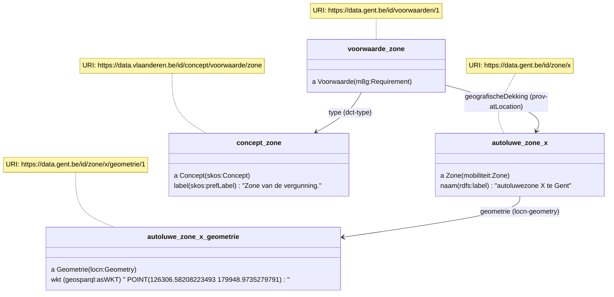
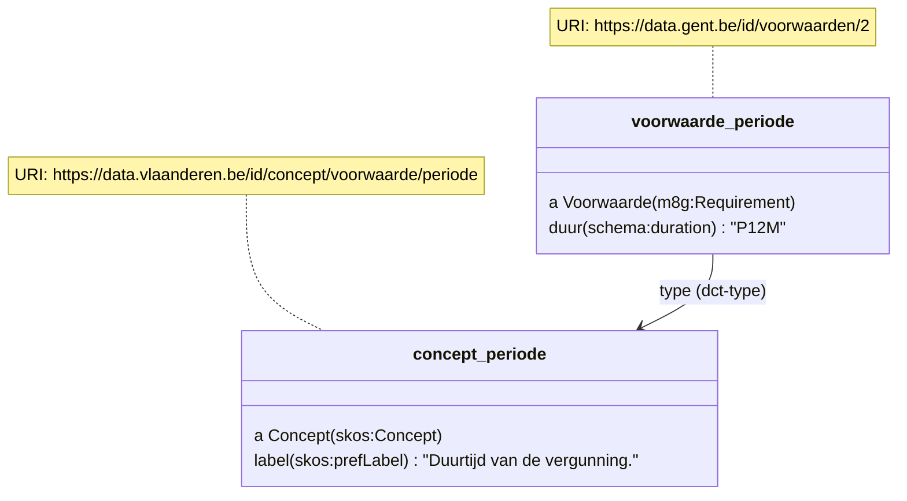
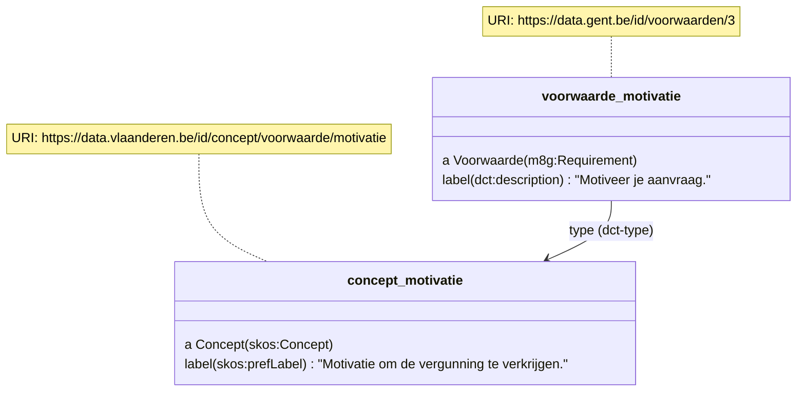

# OSLO Mobiliteit: Intelligente Toegang - implementatiemodel LBLOD (Citerra project)

Deze repository voorziet voorbeelden om voorwaarden voor toegang autoluwe zones semantisch te beschrijven.

Deze voorbeelden zijn beschreven in RDFa formaat om besluiten op een machine-leesbare manier te ontsluiten.

Op dit moment ligt de focus op minimale voorbeeldjes om het OSLO model [OSLO Mobiliteit: Intelligente Toegang](https://data.vlaanderen.be/doc/applicatieprofiel/mobiliteit-intelligente-toegang) af te toetsen.
Later kunnen reglementteksten uit de praktijk hieraan toevoegd worden.

## Vergunningszone


Om een autoluwe zone te beschrijven, gebruiken we de klasse `Zone` en eigenschappen `naam` en `geometrie`.

```
<div prefix="besluit: http://data.vlaanderen.be/ns/besluit# mobiliteit: https://data.vlaanderen.be/ns/mobiliteit# eli: http://data.europa.eu/eli/ontology# prov: http://www.w3.org/ns/prov# adres: https://data.vlaanderen.be/ns/adres# locn: http://www.w3.org/ns/locn# rdfs: http://www.w3.org/2000/01/rdf-schema# geosparql: http://www.opengis.net/ont/geosparql# m8g: http://data.europa.eu/m8g/">
    <div typeof="mobiliteit:Zone" resource="https://data.gent.be/id/zone/x">
      <span property="rdfs:label">zone X</span>.
      <div property="locn:geometry" typeof="locn:Geometry" resource="https://data.gent.be/id/zone/x/geometrie/1">
<span property="geosparql:asWKT" content="<http://www.opengis.net/def/crs/EPSG/0/31370> POINT(126306.58208223493 179948.9735279791)" datatype="geosparql:wktLiteral"></span>
      </div>
    </div>
  </div>
```

Een voorwaarde met type `zone` kan naar deze zone vervolgens verwijzen:

```
  <div typeof="m8g:Requirement" resource="https://data.gent.be/id/voorwaarden/1">
    <span property="dct:type" value="https://data.vlaanderen.be/id/concept/voorwaarde/zone">Zone
    <div property="prov:atLocation" typeof="https://data.vlaanderen.be/ns/mobiliteit#Zone" resource="https://data.gent.be/id/zone/x"> X
  </div>
</div>
```



Het kan wenselijk zijn om zones in een ander (GIS) systeem te beheren.
Te bekijken of [heeftMeerInfo](https://data.vlaanderen.be/doc/applicatieprofiel/slimmeraadpleegomgeving/#Stuk%3AheeftMeerInfo) voldoende is om het reglement te laten wijzen naar een pagina met meer info over de zones.

## Periode

Om te beschrijven hoelang een vergunning geldig is, gebruiken we een `Voorwaarde` met type `periode` en eigenschap `duur` (`https://schema.org/duration`). Duur wordt uitgedrukt als een interval volgens iso 8601, bv P1D 1 dag, P12M 12 maanden...	

```
<div prefix="besluit: http://data.vlaanderen.be/ns/besluit# eli: http://data.europa.eu/eli/ontology# prov: http://www.w3.org/ns/prov# adres: https://data.vlaanderen.be/ns/adres# locn: http://www.w3.org/ns/locn# rdfs: http://www.w3.org/2000/01/rdf-schema# geosparql: http://www.opengis.net/ont/geosparql# m8g: http://data.europa.eu/m8g/ schema: https://schema.org/">
Deze vergunning is 
  <div typeof="m8g:Requirement" resource="https://data.gent.be/id/voorwaarden/2">
    <span property="dct:type" resource="https://data.vlaanderen.be/id/concept/voorwaarde/periode"></span>
    <span property="schema:duration" value="P12M">12 maanden</span>
    geldig
  </div>
</div>
```



## Extra info

### Motivatie

```
<div prefix="besluit: http://data.vlaanderen.be/ns/besluit# eli: http://data.europa.eu/eli/ontology# prov: http://www.w3.org/ns/prov# adres: https://data.vlaanderen.be/ns/adres# locn: http://www.w3.org/ns/locn# rdfs: http://www.w3.org/2000/01/rdf-schema# geosparql: http://www.opengis.net/ont/geosparql# m8g: http://data.europa.eu/m8g/ schema: https://schema.org/">
De aanvraag dient de aanvraag  
  <div typeof="m8g:Requirement" resource="https://data.gent.be/id/voorwaarden/3">
    <span property="dct:type" resource="https://data.vlaanderen.be/id/concept/voorwaarde/motivatie">te motiveren.</span>
  </div>
</div>
```



### Deelwagen

Voorwaarde vraag deelwagen ja / nee

Indien ja, extra voorwaarde met document
