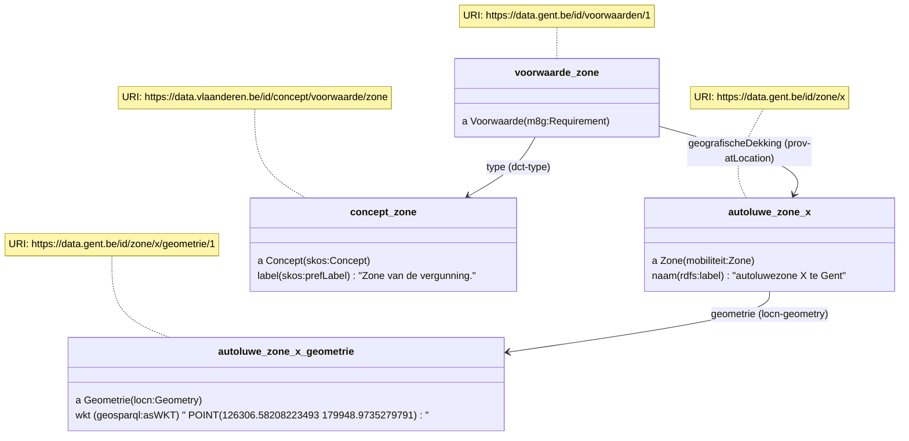
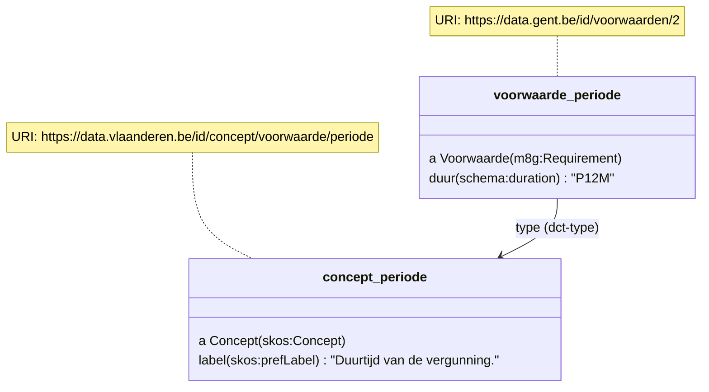
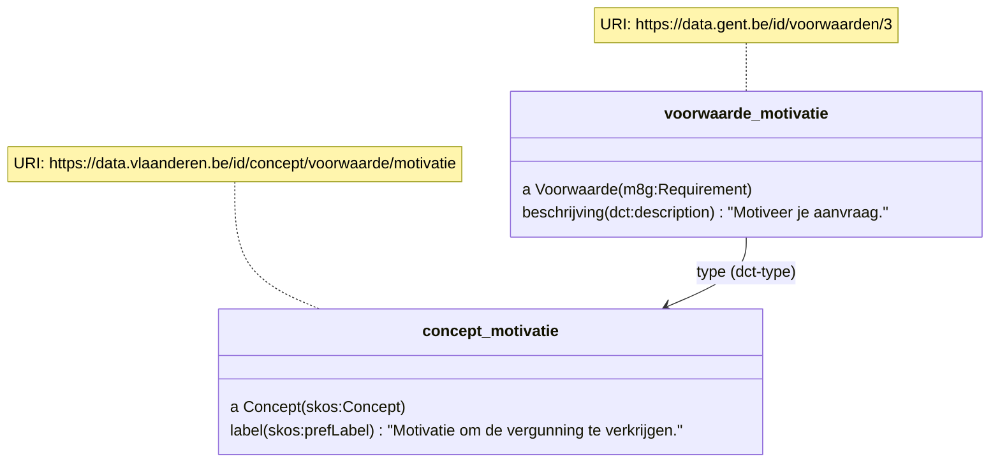

# OSLO Mobiliteit: Intelligente Toegang - implementatiemodel LBLOD (Citerra project)

Deze repository voorziet voorbeelden om voorwaarden voor toegang autoluwe zones semantisch te beschrijven.

Deze voorbeelden zijn beschreven in RDFa formaat om besluiten op een machine-leesbare manier te ontsluiten.

Op dit moment ligt de focus op minimale voorbeeldjes om het OSLO model [OSLO Mobiliteit: Intelligente Toegang](https://data.vlaanderen.be/doc/applicatieprofiel/mobiliteit-intelligente-toegang) af te toetsen.
Later kunnen reglementteksten uit de praktijk hieraan toevoegd worden.

## Vergunning autoluwe zone (publieke dienstverlening)

* In welke steden wordt een dienstverlening aangeboden om een vergunning voor autoluwe zone te verkrijgen?

```
prefix cpsv: <http://purl.org/vocab/cpsv#>
prefix m8g: <http://data.europa.eu/m8g/>
prefix mit: <https://data.vlaanderen.be/ns/mobiliteit-intelligente-toegang#>
prefix dct: <http://purl.org/dc/terms/>

select ?bestuurseenheid ?dienstverlening
where {
  ?dienstverlening a cpsv:PublicService ;
                  m8g:hasCompetentAuthority ?bestuurseenheid ;
                  mit:heeftOutputtype <http://data.vlaanderen.be/id/concept/PubliekeDienstverleningOutputCode/5ab0e9b8a3b2ca7c5e00001b> .
}
```
TODO: codelijst aanmaken met output code "vergunning autoluwe zone"

## Definitie vergunningszone

* Wat is de naam en geometrie van een zone?
* Welke straten zijn gekoppeld met een zone?

```
prefix mobiliteit: <https://data.vlaanderen.be/ns/mobiliteit#>
prefix locn: <http://www.w3.org/ns/locn#>
prefix rdfs: <http://www.w3.org/2000/01/rdf-schema#>
prefix geosparql: <http://www.opengis.net/ont/geosparql#>
prefix cpsv: <http://purl.org/vocab/cpsv#>
prefix m8g: <http://data.europa.eu/m8g/>
prefix mit: <https://data.vlaanderen.be/ns/mobiliteit-intelligente-toegang#>
prefix dct: <http://purl.org/dc/terms/>

select ?zone ?zoneLabel ?wkt
where {
  ?zone a mobiliteit:Zone ;
      locn:geometry ?geometrie ;
      rdfs:label ?zonelabel ;
      dct:type ?zoneType .

  ?geometrie geosparql:asWKT ?wkt .

  VALUES ?zoneType { <http://data.vlaanderen.be/id/concept/ZoneType/5ab0e9b8a3b2ca7c5e00001b> }
}
```

TODO: codelijst om type van een Zone aan te duiden, met name dat het een autoluwe zone is

Om een autoluwe zone te beschrijven, gebruiken we de klasse `Zone` en eigenschappen `naam` en `geometrie`.

```
<div prefix="besluit: http://data.vlaanderen.be/ns/besluit# mobiliteit: https://data.vlaanderen.be/ns/mobiliteit# eli: http://data.europa.eu/eli/ontology# prov: http://www.w3.org/ns/prov# adres: https://data.vlaanderen.be/ns/adres# locn: http://www.w3.org/ns/locn# rdfs: http://www.w3.org/2000/01/rdf-schema# geosparql: http://www.opengis.net/ont/geosparql# m8g: http://data.europa.eu/m8g/ dct: http://purl.org/dc/terms/">
    <div typeof="mobiliteit:Zone" resource="https://data.gent.be/id/zone/x">
        <span property="dct:type" value="http://data.vlaanderen.be/id/concept/ZoneType/5ab0e9b8a3b2ca7c5e00001b"></span>
    1.	<span property="rdfs:label">Autoluw gebied 1</span>:
         <div property="locn:geometry" typeof="locn:Geometry" resource="https://data.gent.be/id/zone/x/geometrie/1">
          <span property="geosparql:asWKT" content="<http://www.opengis.net/def/crs/EPSG/0/31370> POINT(126306.58208223493 179948.9735279791)" datatype="geosparql:wktLiteral"></span>
        </div>
    •	Diestsestraat, tussen Margarethaplein en huisnummer 188/209 en tussen Vanden Tymplestraat en R23; 
    •	Jodenstraat; 
    •	Leopold Vanderkelenstraat, tussen de Diestsestraat en de Bondgenotenlaan; 
    •	Puttegang; 
    •	Sint-Maartenstraat, tussen de Diestsestraat en parking Sint-Maartensdal (huisnummers 1, 1A en 2 - 18); 
    •	Vaartstraat, tussen de Diestsestraat en parking Gerechtsgebouw (huisnummer 7).
    </div>
</div>
```

TODO: straten annoteren

# Nieuwe aanpak

In deze nieuwe aanpak wordt er vanuit 2 insteken vertrokken:
- welke informatie (query) moet een formulier kunnen opvragen om het formulier te kunnen opbouwen
- hoe kunnen we het reglement annoteren op zodanige manier dat de originele opbouw van de tekst behouden blijft (geen datamodel push, wat in de oude aanpak onderaan wel het geval is met AND/OR constructies)

## Vergunningszone

* In welke zones is er een dienstverlening "vergunning autoluwe zone" van toepassing?

Zones kunnen op twee manieren gekoppeld worden aan de dienstverlening (vergunning).
Enerzijds impliciet wanneer deze eenmalig bovenaan het reglement (of in bijlage) wordt beschreven, anderzijds expliciet wanneer de zones opgelijst staan in het artikel/hoofdstuk van de dienstverlening.

### Impliciet

In een reglement worden zones typisch bovenaan eenmalig gedefinieerd, zoals definities.
Deze zones zijn dan impliciet van toepassing bij de beschrijving van de dienstverlening.

Om de zones van de dienstverlening terug te vinden, gebruiken we dus het besluit zelf waarin deze vermeld staan:

```
prefix mobiliteit: <https://data.vlaanderen.be/ns/mobiliteit#>
prefix locn: <http://www.w3.org/ns/locn#>
prefix rdfs: <http://www.w3.org/2000/01/rdf-schema#>
prefix geosparql: <http://www.opengis.net/ont/geosparql#>
prefix sro: <https://data.vlaanderen.be/ns/slimmeraadpleegomgeving#>
prefix dct: <http://purl.org/dc/terms/>
prefix belgif: <http://vocab.belgif.be/ns/publicservice#>
prefix ext: <http://mu.semte.ch/vocabularies/ext/>
prefix cpsv: <http://purl.org/vocab/cpsv#>
prefix m8g: <http://data.europa.eu/m8g/>
prefix mit: <https://data.vlaanderen.be/ns/mobiliteit-intelligente-toegang#>

select ?dienstverlening ?zone
where {
  ?reglement a foaf:Document .

  ?besluit a besluit:Besluit ;
          dct:isPartOf ?reglement ;
          sro:bekrachtigt ?dienstverlening .

  ?zone a mobiliteit:Zone ;
        dct:type ?zoneType .

  {
    ?reglement prov:atLocation ?zone .
    FILTER NOT EXISTS {
      ?dienstverlening belgif:hasRequirement/dct:type <https://data.vlaanderen.be/id/concept/VoorwaardeType/zone> .
    }
  }
  UNION {
    ?dienstverlening belgif:hasRequirement ?voorwaarde .

    ?voorwaarde dct:type <https://data.vlaanderen.be/id/concept/VoorwaardeType/zone> ;
                ext:expectedValue ?zone .
  }

  VALUES ?zoneType { <http://data.vlaanderen.be/id/concept/ZoneType/5ab0e9b8a3b2ca7c5e00001b> }
}
```

```
<head>
    <meta charset="utf-8">
    <title>REGLEMENT BETREFFENDE DE TOEGANG TOT HET VOETGANGERSGEBIED</title>
</head>
<body>

  <div vocab="http://data.vlaanderen.be/ns/besluit#" prefix="lblod: http://data.lblod.info/vocabularies/lblod/ eli: http://data.europa.eu/eli/ontology# prov: http://www.w3.org/ns/prov# mandaat: http://data.vlaanderen.be/ns/mandaat# besluit: http://data.vlaanderen.be/ns/besluit# generiek: http://data.vlaanderen.be/ns/generiek# person: http://www.w3.org/ns/person# persoon: http://data.vlaanderen.be/ns/persoon# dct: http://purl.org/dc/terms/ skos: http://www.w3.org/2004/02/skos/core# org: http://www.w3.org/ns/org# foaf: http://xmlns.com/foaf/0.1/ ext: http://mu.semte.ch/vocabularies/ext/ besluittype: https://data.vlaanderen.be/id/concept/BesluitType/ elod: http://linkedeconomy.org/ontology# lblodBesluit: http://lblod.data.gift/vocabularies/besluit/ mobiliteit: https://data.vlaanderen.be/ns/mobiliteit#">

<div typeof="foaf:Document https://data.vlaanderen.be/id/concept/BesluitType/67378dd0-5413-474b-8996-d992ef81637a"
          resource="http://een.domein.van.leuven.be/leuven/a361ed84-4c47-4ee7-b2f9-2411a15d56ff-6">
            <p>
Volgende straten worden voorzien van een verkeersbord F103, al dan niet met een onderbord dat de wettelijke uitzonderingen bepaalt:
            </p>
    <div resource="https://data.leuven.be/id/zone/1"
      typeof="mobiliteit:Zone"
      property="prov:atLocation">
      <span property="dct:type" resource="http://data.vlaanderen.be/id/concept/ZoneType/5ab0e9b8a3b2ca7c5e00001b"></span>
        <span property="rdfs:label">Stadsdeel blauw</span>:
        <div property="locn:geometry" typeof="locn:Geometry" resource="https://data.leuven.be/id/zone/1/geometrie/1">
          <span property="geosparql:asWKT" content="<http://www.opengis.net/def/crs/EPSG/0/31370> POINT(126306.58208223493 179948.9735279791)" datatype="geosparql:wktLiteral"></span>
        </div>
      </span>
    </div>
    <div resource="https://data.leuven.be/id/zone/2"
      typeof="mobiliteit:Zone"
      property="prov:atLocation">
      <span property="dct:type" resource="http://data.vlaanderen.be/id/concept/ZoneType/5ab0e9b8a3b2ca7c5e00001b"></span>
        <span property="rdfs:label">Stadsdeel groen</span>:
        <div property="locn:geometry" typeof="locn:Geometry" resource="https://data.leuven.be/id/zone/2/geometrie/1">
          <span property="geosparql:asWKT" content="<http://www.opengis.net/def/crs/EPSG/0/31370> POINT(126306.58208223493 179948.9735279791)" datatype="geosparql:wktLiteral"></span>
        </div>
      </span>
    </div> 
  </div>

  <div rev="dct:isPartOf" resource="http://data.lblod.info/id/besluiten/72b89f05-7398-4c12-890c-a130decac4f8" typeof="besluit:Besluit">
    <p>Artikel 1. </p>
    <h4 class="h4" property="eli:title" datatype="xsd:string">De vergunning geldig voor één jaar en voor alle autovrije gebieden</h4>
    <span property="eli:language" resource="http://publications.europa.eu/resource/authority/language/NLD" typeof="skos:Concept">NL</span>
    <p property="eli:description" datatype="xsd:string"></p>

    <div property="sro:bekrachtigt" resource="http://data.lblod.info/id/dienstverlening/1" typeof="cpsv:PublicService">
      <span property="m8g:hasCompetentAuthority" resource="https://data.lblod.info/id/bestuursorganen/4de2e9b8044fdac4a6b6ab0cabede7917dd7274c88ed8f5cadae89e1e5ee8bd6"></span>
      <span property="mit:heeftOutputtype" resource="http://data.vlaanderen.be/id/concept/PubliekeDienstverleningOutputCode/5ab0e9b8a3b2ca7c5e00001b"></span>
      § 1. Deze vergunning kan worden aangevraagd door één van de volgende doelgroepen:
        ...
    </div>
  </div>
</body>
```

### Expliciet

Wanneer de zone expliciet benoemd wordt bij de dienstverlening, beschrijven we de zone als een voorwaarde met type `zone` en een relatie naar een Zone-object:

```
  <div rev="dct:isPartOf" resource="http://data.lblod.info/id/besluiten/72b89f05-7398-4c12-890c-a130decac4f8" typeof="besluit:Besluit">
    <p>Artikel 1. </p>
    <h4 class="h4" property="eli:title" datatype="xsd:string">De vergunning geldig voor één jaar en voor autoluw gebied 1</h4>

    <div property="sro:bekrachtigt" resource="http://data.lblod.info/id/dienstverlening/1" typeof="cpsv:PublicService">
      <span property="m8g:hasCompetentAuthority" resource="https://data.lblod.info/id/bestuursorganen/4de2e9b8044fdac4a6b6ab0cabede7917dd7274c88ed8f5cadae89e1e5ee8bd6">        </span>
      <span property="mit:heeftOutputtype" resource="http://data.vlaanderen.be/id/concept/PubliekeDienstverleningOutputCode/5ab0e9b8a3b2ca7c5e00001b"></span>

      <div property="http://vocab.belgif.be/ns/publicservice#hasRequirement" typeof="m8g:Requirement" resource="http://data.lblod.info/id/voorwaarden/1">
        <span property="dct:type" value="https://data.vlaanderen.be/id/concept/VoorwaardeType/zone">
        <div property="dct:description" lang="nl">
            <p>§ 1. Deze vergunning kan enkel aangevraagd worden voor volgende zones:</p>
            <div resource="https://data.lblod.info/id/zone/1"
              typeof="mobiliteit:Zone"
              property="ext:expectedValue">
              <span property="dct:type" resource="http://data.vlaanderen.be/id/concept/ZoneType/5ab0e9b8a3b2ca7c5e00001b"></span>
              <p>- </p><span property="rdfs:label">Autoluwgebied 1</span>:
              <div property="locn:geometry" typeof="locn:Geometry" resource="https://data.lblod.info/id/zone/1/geometrie/1">
                <span property="geosparql:asWKT" content="<http://www.opengis.net/def/crs/EPSG/0/31370> POINT(126306.58208223493 179948.9735279791)" datatype="geosparql:wktLiteral"></span>
              </div>
            </div>
        </div>
      </div>

    </div>
```

TODO: OSLO Intelligente toegang vocabularium uitbreiden met term om rechtstreeks van een Requirement de te verwachten waarde te beschrijven. Momenteel "ext:expectedValue". In CCCEV is het enkel mogelijk om via Information Concept de expected value te beschrijven, en moet via een "regel"-taal gebeuren (RIF, SHACL...). Om 1 specifieke waarde aan te duiden is dit dus overkill.

## Algemene voorwaarden

* Welke doelgroepen komen in aanmerking voor een vergunning?

```
prefix mobiliteit: <https://data.vlaanderen.be/ns/mobiliteit#>
prefix locn: <http://www.w3.org/ns/locn#>
prefix rdfs: <http://www.w3.org/2000/01/rdf-schema#>
prefix geosparql: <http://www.opengis.net/ont/geosparql#>
prefix sro: <https://data.vlaanderen.be/ns/slimmeraadpleegomgeving#>
prefix dct: <http://purl.org/dc/terms/>
prefix belgif: <http://vocab.belgif.be/ns/publicservice#>
prefix ext: <http://mu.semte.ch/vocabularies/ext/>
prefix cpsv: <http://purl.org/vocab/cpsv#>
prefix m8g: <http://data.europa.eu/m8g/>
prefix mit: <https://data.vlaanderen.be/ns/mobiliteit-intelligente-toegang#>

select ?dienstverlening ?doelgroep
where {
  ?dienstverlening belgif:hasRequirement ?voorwaarde .

  ?voorwaarde dct:type <https://data.vlaanderen.be/id/concept/VoorwaardeType/doelgroep> ;
              ext:expectedValue ?doelgroep .
}
```

```
<div property="sro:bekrachtigt" resource="http://data.lblod.info/id/dienstverlening/1" typeof="cpsv:PublicService">
      <p>§ 1. Deze vergunning kan worden aangevraagd door één van de volgende doelgroepen:</p>
      <div property="belgif:hasRequirement" typeof="m8g:Requirement" resource="http://data.lblod.info/id/voorwaarden/1">
        <span property="dct:type" value="https://data.vlaanderen.be/id/concept/VoorwaardeType/doelgroep">
        <div property="dct:description" lang="nl">
            - <span property="ext:expectedValue" resource="https://data.lblod.info/id/doelgroep/1" typeof="skos:Concept">Zorgverstrekker</span>
        </div>
      </div>
      <div property="belgif:hasRequirement" typeof="m8g:Requirement" resource="http://data.lblod.info/id/voorwaarden/2">
        <span property="dct:type" value="https://data.vlaanderen.be/id/concept/VoorwaardeType/doelgroep">
        <div property="dct:description" lang="nl">
            - <span property="ext:expectedValue" resource="https://data.lblod.info/id/doelgroep/2" typeof="skos:Concept">de rechtspersoon die nutsdiensten levert</span>
        </div>
      </div>
</div>
```

Idealiter is "Doelgroep" een Voorwaardecollectie met een OF-operand en zijn de specifieke doelgroepen Voorwaarden hiervan, maar hier wordt er impliciet een OF verondersteld. Als het formulier enkel de lijst van doelgroepen wil ophalen zoals in de query hierboven, heeft het geen zin om dit complexer te maken.

* Welke activiteiten komen in aanmerking voor een vergunning?

```
prefix mobiliteit: <https://data.vlaanderen.be/ns/mobiliteit#>
prefix locn: <http://www.w3.org/ns/locn#>
prefix rdfs: <http://www.w3.org/2000/01/rdf-schema#>
prefix geosparql: <http://www.opengis.net/ont/geosparql#>
prefix sro: <https://data.vlaanderen.be/ns/slimmeraadpleegomgeving#>
prefix dct: <http://purl.org/dc/terms/>
prefix belgif: <http://vocab.belgif.be/ns/publicservice#>
prefix ext: <http://mu.semte.ch/vocabularies/ext/>
prefix cpsv: <http://purl.org/vocab/cpsv#>
prefix m8g: <http://data.europa.eu/m8g/>
prefix mit: <https://data.vlaanderen.be/ns/mobiliteit-intelligente-toegang#>

select ?dienstverlening ?activiteit
where {
  ?dienstverlening belgif:hasRequirement ?voorwaarde .

  ?voorwaarde dct:type <https://data.vlaanderen.be/id/concept/VoorwaardeType/activiteit> ;
              ext:expectedValue ?activiteit .
}
```

```
<div property="sro:bekrachtigt" resource="http://data.lblod.info/id/dienstverlening/1" typeof="cpsv:PublicService">
      ...
      <p>De vergunning heeft als doel om op regelmatige en onvoorzienbare tijdstippen in de autovrije gebieden:</p>
      <div property="belgif:hasRequirement" typeof="m8g:Requirement" resource="http://data.lblod.info/id/voorwaarden/1">
        <span property="dct:type" value="https://data.vlaanderen.be/id/concept/VoorwaardeType/activiteit">
        <div property="dct:description" lang="nl">
            - a. <div property="ext:expectedValue" resource="http://data.lblod.info/id/dienstverlening/1/activiteit/1" typeof="skos:Concept">
                  <span property="skos:prefLabel" language="nl">goederen te laden en te lossen</span>
                ;</div>
        </div>
      </div>
      <div property="belgif:hasRequirement" typeof="m8g:Requirement" resource="http://data.lblod.info/id/voorwaarden/2">
        <span property="dct:type" value="https://data.vlaanderen.be/id/concept/VoorwaardeType/activiteit">
        <div property="dct:description" lang="nl">
            - b. <div property="ext:expectedValue" resource="http://data.lblod.info/id/dienstverlening/1/activiteit/2" typeof="skos:Concept">
                <span property="skos:prefLabel" language="nl">naar een garage of standplaats te rijden</span>
              .</div>
        </div>
      </div>
</div>
```


## Specifieke voorwaarden

* Welke voorwaarden zijn er specifiek voor deze voorwaarde (doelgroep)?

Naast het behoren tot een bepaalde doelgroep, kunnen er nog andere voorwaarden van toepassing zijn, zoals:
* functie: nutdienst, mantelverzorger
* speciale toestand: gehandicapt, minder mobiel
* activiteit: levering, verhuis, werf

```
prefix mobiliteit: <https://data.vlaanderen.be/ns/mobiliteit#>
prefix locn: <http://www.w3.org/ns/locn#>
prefix rdfs: <http://www.w3.org/2000/01/rdf-schema#>
prefix geosparql: <http://www.opengis.net/ont/geosparql#>
prefix sro: <https://data.vlaanderen.be/ns/slimmeraadpleegomgeving#>
prefix dct: <http://purl.org/dc/terms/>
prefix belgif: <http://vocab.belgif.be/ns/publicservice#>
prefix ext: <http://mu.semte.ch/vocabularies/ext/>
prefix cpsv: <http://purl.org/vocab/cpsv#>
prefix m8g: <http://data.europa.eu/m8g/>
prefix mit: <https://data.vlaanderen.be/ns/mobiliteit-intelligente-toegang#>
PREFIX skos: <http://www.w3.org/2004/02/skos/core#>

select ?specifiekeVoorwaardeBeschrijving ?verwachteWaardeVanSpecifiekeVoorwaardeLabel
where {
  ?specifiekeVoorwaarde m8g:isRequirementOf ?voorwaarde ;
                        dct:description ?specifiekeVoorwaardeBeschrijving .

  OPTIONAL {
    ?specifiekeVoorwaarde dct:type ?specifiekeVoorwaardeType .
  }

  OPTIONAL {
    ?specifiekeVoorwaarde ext:expectedValue ?verwachteWaardeVanSpecifiekeVoorwaarde .
    ?verwachteWaardeVanSpecifiekeVoorwaarde skos:prefLabel ?verwachteWaardeVanSpecifiekeVoorwaardeLabel .
  }


  VALUE ?voorwaarde { <http://data.lblod.info/id/voorwaarden/1> }
}
```

Opmerking: het type van de specifieke voorwaarde is optioneel, wanneer deze niet uit de codelijst komt.

```
  a. voor de zorgverstrekker , vermeld in § 1, a.:

<div property="belgif:hasRequirement" typeof="m8g:Requirement" resource="http://data.lblod.info/id/voorwaarden/3">
  <span property="m8g:isRequirementOf" resource="http://data.lblod.info/id/voorwaarden/1"></span>
  <span property="dct:type" value="https://data.vlaanderen.be/id/concept/VoorwaardeType/activiteit">
  <div property="dct:description" lang="nl">
    1) hetzij, voor <div property="ext:expectedValue" resource="http://data.lblod.info/id/voorwaarden/3/expectedvalue/1" typeof="skos:Concept">
                  <span property="skos:prefLabel" language="nl">huisbezoek aan patiënten</span>
                ;</div>
  </div>
</div>
```

Het beschrijven van de verwachte waarde aan de hand van een codelijst kan optioneel zijn.
Dan is er enkel een beschrijving van de voorwaarde.

## Bewijsstukken

* Welk(e) bewijsstuk(ken) zijn nodig om aan te tonen dat een voorwaarde voldaan is?

```
<p>Bij de aanvraag van deze vergunning moeten de volgende gegevens worden opgegeven en de
volgende bewijsstukken worden gevoegd:</p>

  a. voor de zorgverstrekker , vermeld in § 1, a.:

    1) hetzij een
    <div about="http://data.lblod.info/id/voorwaarden/1">
      <div rev="m8g:hasEvidenceTypeList" typeof="m8g:EvidenceTypeList" resource="https://data.lblod.info.id/bewijstypelijst/1">
          <div property="m8g:specifiesEvidenceType" typeof="m8g:EvidenceType" resource="https://data.lblod.info/id/bewijstype/1">
              <div property="m8g:evidenceTypeClassification" value="https://data.vlaanderen.be/id/concept/bewijstypeclassificatie/riziv-nummer">
                <span property="skos:prefLabel" language="nl">RIZIV-nummer</span>;
              </div>
            </div>
      </div>
    </div>
```

Opmerking: het RDFa attribuut "about" wordt gebruikt om het bewijsstuk aan een specifieke voorwaarde ("zorgverstrekker" toe te voegen)

## Kenmerken van toepassing op de selectie van voorwaarde

Afhankelijk van de doelgroep, activiteit... zijn andere kenmerken van toepassing.

Voorbeelden van kenmerken:
* Aantal zones waarvoor de vergunning aangevraagd kan worden
* De duurtijd (Tijdschema: beperkte periode, van uren tot dagen tot jaren)
* Tijdsvenster (onbeperkt of tussen bepaalde uren)
* Aantal nummerplaten
* Kostprijs


# Oude aanpak

## Vergunningszone

Om een autoluwe zone te beschrijven, gebruiken we de klasse `Zone` en eigenschappen `naam` en `geometrie`.

```
<div prefix="besluit: http://data.vlaanderen.be/ns/besluit# mobiliteit: https://data.vlaanderen.be/ns/mobiliteit# eli: http://data.europa.eu/eli/ontology# prov: http://www.w3.org/ns/prov# adres: https://data.vlaanderen.be/ns/adres# locn: http://www.w3.org/ns/locn# rdfs: http://www.w3.org/2000/01/rdf-schema# geosparql: http://www.opengis.net/ont/geosparql# m8g: http://data.europa.eu/m8g/ dct: http://purl.org/dc/terms/">
    <div typeof="mobiliteit:Zone" resource="https://data.gent.be/id/zone/x">
      <span property="rdfs:label">zone X</span>.
      <div property="locn:geometry" typeof="locn:Geometry" resource="https://data.gent.be/id/zone/x/geometrie/1">
<span property="geosparql:asWKT" content="<http://www.opengis.net/def/crs/EPSG/0/31370> POINT(126306.58208223493 179948.9735279791)" datatype="geosparql:wktLiteral"></span>
      </div>
    </div>
  </div>
```

Een voorwaarde met type `zone` kan naar deze zone vervolgens verwijzen:

```
  <div typeof="m8g:Requirement" resource="https://data.gent.be/id/voorwaarden/1">
    <span property="dct:type" value="https://data.vlaanderen.be/id/concept/voorwaarde/zone">Zone
    <div property="prov:atLocation" typeof="https://data.vlaanderen.be/ns/mobiliteit#Zone" resource="https://data.gent.be/id/zone/x"> X
  </div>
</div>
```



Het kan wenselijk zijn om zones in een ander (GIS) systeem te beheren.
Te bekijken of [heeftMeerInfo](https://data.vlaanderen.be/doc/applicatieprofiel/slimmeraadpleegomgeving/#Stuk%3AheeftMeerInfo) voldoende is om het reglement te laten wijzen naar een pagina met meer info over de zones.

## Periode

Om te beschrijven hoelang een vergunning geldig is, gebruiken we een `Voorwaarde` met type `periode` en eigenschap `duur` (`https://schema.org/duration`). Duur wordt uitgedrukt als een interval volgens iso 8601, bv P1D 1 dag, P12M 12 maanden...	

```
<div prefix="besluit: http://data.vlaanderen.be/ns/besluit# eli: http://data.europa.eu/eli/ontology# prov: http://www.w3.org/ns/prov# adres: https://data.vlaanderen.be/ns/adres# locn: http://www.w3.org/ns/locn# rdfs: http://www.w3.org/2000/01/rdf-schema# geosparql: http://www.opengis.net/ont/geosparql# m8g: http://data.europa.eu/m8g/ schema: https://schema.org/ dct: http://purl.org/dc/terms/">
Deze vergunning is 
  <div typeof="m8g:Requirement" resource="https://data.gent.be/id/voorwaarden/2">
    <span property="dct:type" resource="https://data.vlaanderen.be/id/concept/voorwaarde/periode"></span>
    <span property="schema:duration" value="P12M">12 maanden</span>
    geldig
  </div>
</div>
```



## Extra info

### Motivatie

```
<div prefix="besluit: http://data.vlaanderen.be/ns/besluit# eli: http://data.europa.eu/eli/ontology# prov: http://www.w3.org/ns/prov# adres: https://data.vlaanderen.be/ns/adres# locn: http://www.w3.org/ns/locn# rdfs: http://www.w3.org/2000/01/rdf-schema# geosparql: http://www.opengis.net/ont/geosparql# m8g: http://data.europa.eu/m8g/ schema: https://schema.org/ dct: http://purl.org/dc/terms/">
De aanvraag moet   
  <div typeof="m8g:Requirement" resource="https://data.gent.be/id/voorwaarden/3">
    <span property="dct:type" resource="https://data.vlaanderen.be/id/concept/voorwaarde/motivatie">gemotiveerd</span>
  </div>
worden.
</div>
```



### Deelwagen

Voorwaarde dat het gebruik van een deelwagen nagaat.

Is een collectie van voorwaarden waarbij gekozen moet worden (OR) tussen volgende voorwaarden:
* Voorwaarde: Gebruikt geen deelwagen
* Terug een collectie van voorwaarden (AND):
  * Gebruikt wel een deelwagen
  * Bewijs deelwagen

```
<div prefix="besluit: http://data.vlaanderen.be/ns/besluit# eli: http://data.europa.eu/eli/ontology# prov: http://www.w3.org/ns/prov# adres: https://data.vlaanderen.be/ns/adres# locn: http://www.w3.org/ns/locn# rdfs: http://www.w3.org/2000/01/rdf-schema# geosparql: http://www.opengis.net/ont/geosparql# m8g: http://data.europa.eu/m8g/ mit: https://data.vlaanderen.be/ns/mobiliteit-intelligente-toegang# schema: https://schema.org/ dct: http://purl.org/dc/terms/">
De aanvrager moet aangeven
<div typeof="mit:Voorwaardecollectie m8g:Requirement" resource="https://data.gent.be/id/voorwaarden/4">
    <span property="dct:description">
        of een deelwagen gebruikt zal worden.
        <span property="mit:operatie" value="https://data.vlaanderen.be/id/concept/logischeOperatie/OR"></span>
        <div property="m8g:hasRequirement" typeof="m8g:Requirement" resource="https://data.gent.be/id/voorwaarden/5">
            <span property="dct:type" resource="https://data.vlaanderen.be/id/concept/voorwaarde/gebruiktGeenDeelwagen"></span>
            <span property="dct:description>Ofwel wordt er geen deelvoertuig gebruikt.</span>
        </div>
        <div property="m8g:hasRequirement" typeof="mit:Voorwaardecollectie m8g:Requirement" resource="https://data.gent.be/id/voorwaarden/6">
            <span property="mit:operatie" value="https://data.vlaanderen.be/id/concept/logischeOperatie/AND"></span>
            <div property="m8g:hasRequirement" typeof="m8g:Requirement" resource="https://data.gent.be/id/voorwaarden/7">
                <span property="dct:type" resource="https://data.vlaanderen.be/id/concept/voorwaarde/gebruiktDeelwagen"></span>
                <span property="dct:description>Ofwel wordt er wel een deelvoertuig gebruikt </span>
            </div>
            <div property="m8g:hasRequirement" typeof="m8g:Requirement" resource="https://data.gent.be/id/voorwaarden/8">
                <span property="dct:type" resource="https://data.vlaanderen.be/id/concept/voorwaarde/deelwagenbewijs"></span>
                <span property="dct:description>en wordt aangetoond met een document dat de aanvrager deze deelwagen gebruikt.</span>
                <div property="m8g:hasEvidenceTypeList" typeof="m8g:EvidenceTypeList" resource="https://data.gent.be/id/bewijstypelijst/1">
                    <div property="m8g:specifiesEvidenceType" typeof="m8g:EvidenceType" resource="https://data.gent.be/id/bewijstype/1">
                        <span property="m8g:evidenceTypeClassification" value="https://data.vlaanderen.be/id/concept/bewijstypeclassificatie/deelwagenbewijs"></span>
                    </div>
                </div>
            </div>
        </div>
    </span>
</div>
```


TODO model:
* type niet verplichten op Voorwaardecollectie
