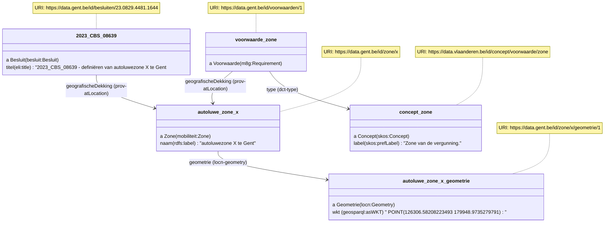

# OSLO Mobiliteit: Intelligente Toegang - implementatiemodel LBLOD (Citerra project)

De opzet van deze repository is om RDFa voorbeelden te maken hoe het model van OSLO Mobiliteit: Intelligente Toegang geïmplementeerd kan worden in besluiten.

De focus ligt op het beschrijven van de voorwaarden van autoluwe zones, zodat deze hergebruikt kunnen worden voor het opbouwen van aanvraagformulieren.

## Vergunningszone


Om een autoluwe zone aan te duiden, gebruiken we een naam en geometrie:

```
<div prefix="besluit: http://data.vlaanderen.be/ns/besluit# eli: http://data.europa.eu/eli/ontology# prov: http://www.w3.org/ns/prov# adres: https://data.vlaanderen.be/ns/adres# locn: http://www.w3.org/ns/locn# rdfs: http://www.w3.org/2000/01/rdf-schema# geosparql: http://www.opengis.net/ont/geosparql# m8g: http://data.europa.eu/m8g/">
  <div property="prov:generated" typeof="besluit:Besluit" resource="https://data.gent.be/id/besluiten/23.0829.9225.8540">
    <span property="eli:title" datatype="xsd:string">2023_CBS_08501 - definiëren van 
    <div property="prov:atLocation" typeof="https://data.vlaanderen.be/ns/mobiliteit#Zone" resource="https://data.gent.be/id/zone/x">
      <span property="rdfs:label">autoluwezone X te Gent</span>.
      <div property="locn:geometry" typeof="locn:Geometry" resource="https://data.gent.be/id/zone/x/geometrie/1">
<span property="geosparql:asWKT" content="<http://www.opengis.net/def/crs/EPSG/0/31370> POINT(126306.58208223493 179948.9735279791)" datatype="geosparql:wktLiteral"></span>
      </div>
    </div>
  </div>

  <div typeof="m8g:Requirement" resource="https://data.gent.be/id/voorwaarden/1">
    <span property="dct:type" value="https://data.vlaanderen.be/id/concept/voorwaarde/zone">Zone
    <div property="prov:atLocation" typeof="https://data.vlaanderen.be/ns/mobiliteit#Zone" resource="https://data.gent.be/id/zone/x"> X
  </div>
</div>
```



## Periode

```
<div prefix="besluit: http://data.vlaanderen.be/ns/besluit# eli: http://data.europa.eu/eli/ontology# prov: http://www.w3.org/ns/prov# adres: https://data.vlaanderen.be/ns/adres# locn: http://www.w3.org/ns/locn# rdfs: http://www.w3.org/2000/01/rdf-schema# geosparql: http://www.opengis.net/ont/geosparql# m8g: http://data.europa.eu/m8g/ schema: https://schema.org/">
Deze vergunning is 
  <div typeof="m8g:Requirement" resource="https://data.gent.be/id/voorwaarden/2">
    <span property="dct:type" resource="https://data.vlaanderen.be/id/concept/voorwaarde/periode"></span>
    <span property="schema:duration" value="P12M">12 maanden</span>
    geldig
  </div>
</div>
```


## Extra info

